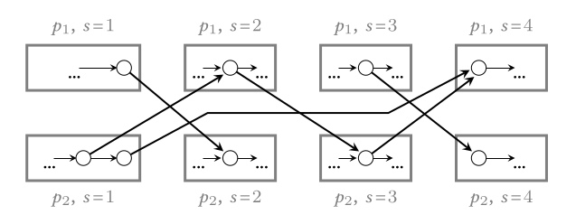
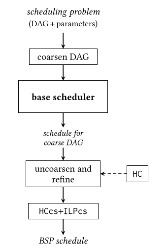
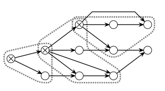
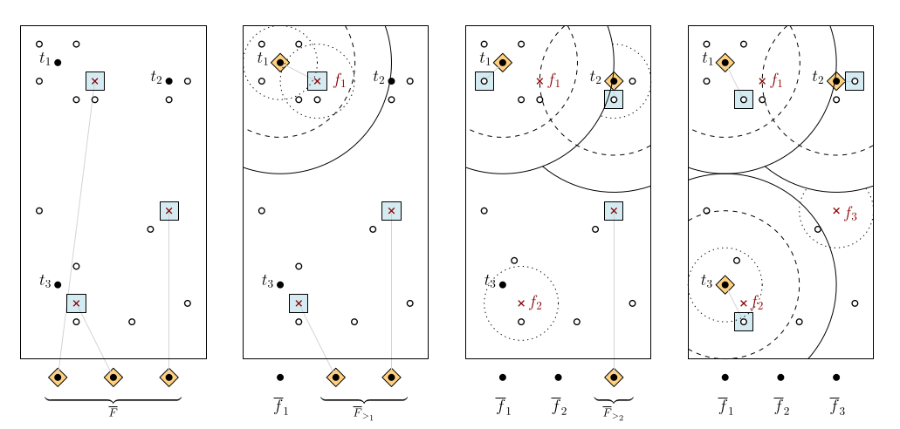
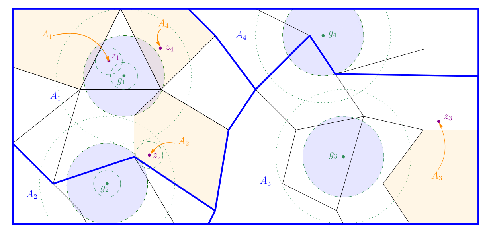
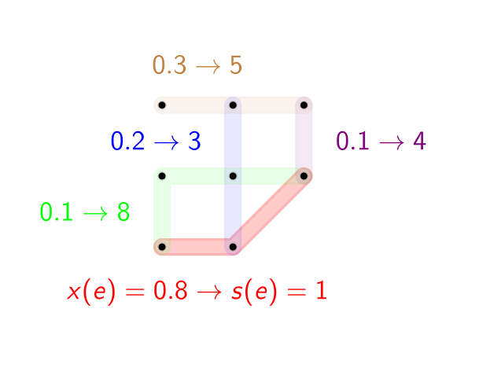
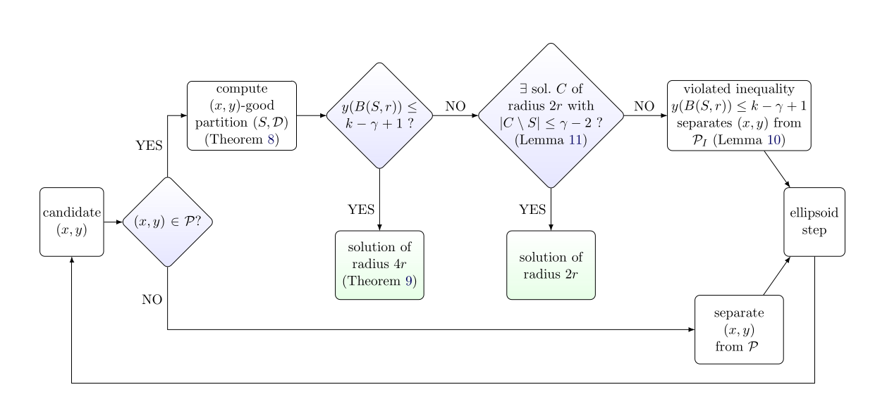

# About me

## Short CV

2023-2024 MBA at CDI Munich   
2018-2023 PhD at ETH Zurich   
2016-2018 Head Tutor at AIMS South Africa   
2012-2016 BA&MMath at University of Cambridge  

See also my [LinkedIn](https://www.linkedin.com/in/georg-anegg/).
My [GitHub](https://github.com/georganegg) currently doesn't have many repositories that are publicly visible but I'm trying to change that soon.

## Get in touch

Feel free to email me at `<firstname>.<lastname>@gmail.com`. 
You can also message me on LinkedIn.

# I am passionate about...

## Software Engineering

I have built bespoke software applications from scratch to production in various data-centric domains, including scientific computing, operations research, and automation. 

Tools I have used include:
- Python (numpy, pandas, scikit-learn, flask, conda, pytest, mypy, pylint), Scala, Matlab, VBA
- Docker, Jenkins, SonarQube, GitLab CI/CD
- git, Linux, bash

## Education

I find learning and teaching to be among the most satisfying activities. 

From a young age, my natural curiosity to understand deeply has led me to mathematics and my desire to share my joy for learning led me to teaching.

My academic journey took me from mathematics to computer science to software to business administration.
As a layperson, I enjoy learning about topics like
Linguistics,
Poetry,
Creativity, 
Humor,
Neuroscience,
Philosophy of Science,
Self-Discovery and Self-Knowledge,
Board Game and Puzzle Strategy,
and Geopolitics.

My teaching-related endeavors include the following.  

2018-2023:  
As a teaching assistant during my doctoral studies, I have given lectures, developed teaching and assessment materials, recruited and guided teaching assistants, and supervised eight student research projects.
My doctoral advisor [received the Golden Owl teaching award](https://math.ethz.ch/news-and-events/news/d-math-news/2021/11/rico-zenklusen-2021-golden-owl.html) for courses I contributed to.
At ETH, I also continued my own learning journey with courses on
Interactive Teaching, 
Student Project Supervision,
Intercultural Teaching, and
Educational Psychology, among others.

As I am passionate about creating educational equity, I contributed to academic outreach and partnership efforts including [this networking event](https://indico.cern.ch/event/962934/) I co-organized and [this teaching endeavour](https://eth4d.ethz.ch/Learning/AshesiETH-Master.html) in Ghana, which you can read about [here](https://math.ethz.ch/news-and-events/news/d-math-news/2022/07/teaching-mathematics-in-africa.html).

2016-2018:  
I was the Head Tutor at the [African Institute for Mathematical Sciences](https://aims.ac.za/) in Cape Town, South Africa. 
As Head Tutor, I was responsible for all teaching-related activities in a graduate mathematics degree program. I led the team of eight graduate teaching assistants and also contributed to the teaching and mentoring.
You can read about it [here](https://ethambassadors.ethz.ch/2019/10/17/the-future-is-african-a-unique-teaching-experience-in-south-africa/).

2012-2014:  
After competing in mathematics competitions ([Bronze Medal IMO 2011](https://www.imo-official.org/participant_r.aspx?id=21073), [Second Price IMC 2012](https://www.imc-math.org.uk/?year=2012&item=results)), I got involved in teaching efforts in this area, i.e. competition preparation.
I have also supervised competitions and have authored a number of original problems that have appeared in national competitions in Austria, see e.g. [here](https://www.math.aau.at/OeMO/problems/ZWF/2015).

## Research

I am interested in both theoretical and applied research in the fields of 
Operations Research (Modelling, Mathematical Programming) and 
Optimization Algorithms (Combinatorial Optimization, Approximation Algorithms).

You can find my published work on 
[GoogleScholar](https://scholar.google.com/citations?user=sr4ehiYAAAAJ&hl=en) and
[dblp](https://dblp.org/pid/262/8265.html).  

### Applied Research

At the Institute for Operations Research at ETH, I have worked with industry and public sector partners as a Business Analytics and Operations Research consultant. 
These include Helvetiv Motion, the Federal Office of Public Health Switzerland, and the Academic Services of ETH Zurich.
Typically, the goal of these projects was applying methods from Operations Research to their business problems, from assessing feasibility to prototyping and productive usage.
Additionally, I have conducted research on fundamental algorithmic questions in computer architecture at Huawei's Zurich Research Center. 

### Theoretical Research

My doctoral research revolved around designing approximation algorithms for various Combinatorial Optimization problems, in particular fair clustering problems. 
Together with collaborators, I made progress on open problems by developing new algorithmic techniques that lead to stronger algorithms for particular classes of problems.

My doctoral advisor was Prof. Dr. Rico Zenklusen and my co-examiner was Prof. Dr. Ola Svensson. I [passed my doctoral exam](https://math.ethz.ch/news-and-events/news/d-math-news/2023/07/doctoral-exam-of-georg-anegg.html) on 05.07.2023.

### Publications

<strong>DAG Scheduling in the BSP Model</strong> 
with P. A. Papp, A. N. Yzelman 
<a href="https://arxiv.org/abs/2303.05989">[arXiv]</a> 
SOFSEM 2025

<strong>Efficient Multi-Processor Scheduling in Increasingly Realistic Models</strong> 
with P. A. Papp, A. Karanasiou, A. N. Yzelman 
<a href="https://arxiv.org/abs/2404.15246">[arXiv]</a> 
SPAA 2024

<strong>Partitioning Hypergraphs is Hard: Models, Inapproximability, and Applications</strong> 
with P. A. Papp, A. N. Yzelman 
<a href="https://arxiv.org/abs/2208.08257">[arXiv]</a> 
SPAA 2023

<strong>A Simple Combinatorial Algorithm for Robust Matroid Center</strong> 
with L. Vargas Koch, R. Zenklusen 
<a href="https://arxiv.org/abs/2211.03601">[arXiv]</a> 
SOSA 2023 

<strong>Techniques for Generalized Colorful k-Center Problems</strong> 
with L. Vargas Koch, R. Zenklusen 
<a href="https://arxiv.org/abs/2207.02609">[arXiv]</a> 
ESA 2022

<strong>Simpler and Stronger Approaches for Non-Uniform Hypergraph Matching and the Füredi, Kahn, and Seymour Conjecture</strong> 
with H. Angelidakis, R. Zenklusen 
<a href="https://arxiv.org/abs/2009.00697">[arXiv]</a> <a href="https://polybox.ethz.ch/index.php/s/zlV4ILQIXBDzD6m">[conference presentation]</a> 
SOSA 2021

<strong>A Technique for Obtaining True Approximations for k-Center with Covering Constraints</strong> 
with H. Angelidakis, A. Kurpisz, R. Zenklusen 
<a href="https://arxiv.org/abs/2007.03946">[arXiv (journal version)]</a> <a href="https://www.youtube.com/watch?v=E7CUukJE_9o">[conference presentation]</a> <a href="ipco2020_poster.pdf">[poster]</a> 
IPCO 2020 (conference), Mathematical Programming 2022 (journal)

